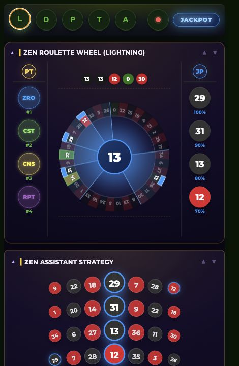
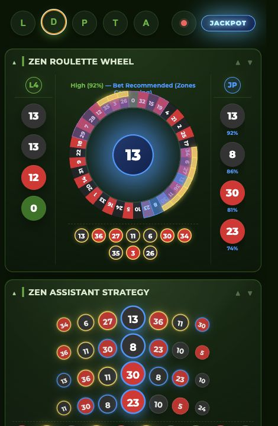
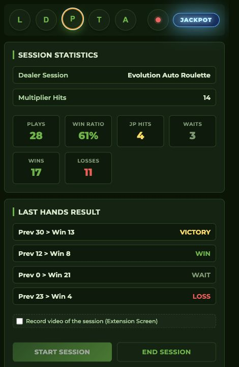
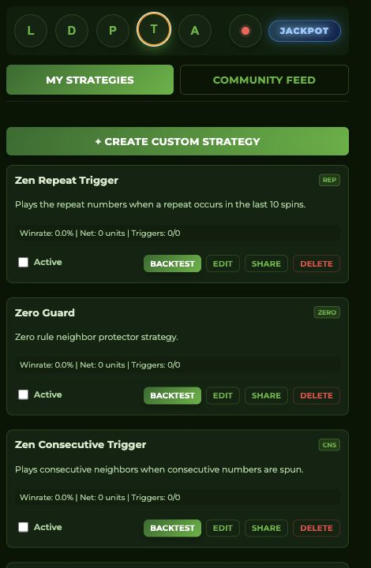
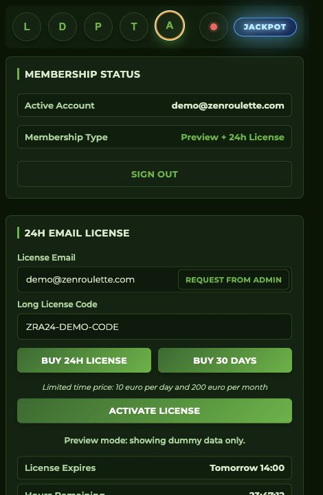

# ZenRoulette Assistant

Professional Chrome side-panel assistant for roulette session tracking, pattern review, and disciplined decision support.



## What It Does

ZenRoulette Assistant reads live roulette history from the active table page and presents it inside a focused Chrome side panel. It helps you follow repeatable rules, watch pattern families, keep session notes, and request a temporary license from your account.

Core modules:

- **Lightning Wheel**: recent numbers, PT pattern chips, JP candidates, and wheel visualization.
- **Dealer Strategy**: recommendation panel, bet groups, jackpot groups, and table context.
- **Session**: dealer info, play log, stats, and Pattern Pre-Check history scan.
- **TradingView of Roulette**: personal strategy workspace and community strategy feed.
- **Account**: login, free Tribe access, license request, and license activation.

Roulette remains a game of chance. This project is an analysis, education, and discipline tool. It does not guarantee winnings or predict outcomes.

## Screenshots

| Lightning | Dealer |
| --- | --- |
|  |  |

| Session | Strategies |
| --- | --- |
|  |  |

| Account |
| --- |
|  |

## Download

Stable public download:

https://zenroulette.com/get/extension/

Versioned releases are also published with Git tags in this repository.

Current version: **2.1.6**

## Install From the ZIP

1. Download `ZenRoulette-Assistant-v2.zip` from the public download link.
2. Unzip the file on your computer.
3. Open Chrome and go to `chrome://extensions/`.
4. Enable **Developer mode**.
5. Click **Load unpacked**.
6. Select the unzipped `ZenRoulette Assistant` folder.
7. Pin the extension and open it from the Chrome toolbar or side panel.

## Join the Tribe for Free

1. Visit https://zenroulette.com.
2. Create or log in to your free account.
3. Open the **Account** tab inside the extension.
4. Sign in with your ZenRoulette account email.
5. Use the Tribe resources, tutorials, and community updates from the website.

## Request a 24-Hour License

1. Open the extension.
2. Go to the **Account** tab.
3. Enter the same email used for your ZenRoulette account.
4. Click **Request** in the License section.
5. Check your email for the license code.
6. Paste the code into **Long License Code** and click **Activate License**.

During promotional windows, eligible accounts may receive one automatic 24-hour license per email within a 24-hour period.

## Local Development

Load the source folder directly in Chrome:

```bash
cd extension
```

Then open `chrome://extensions/`, enable Developer mode, and choose **Load unpacked**.

For browser-only preview screenshots, open `popup.html` directly. The UI uses safe demo data when it runs outside Chrome extension runtime.

## Production Packaging

The WordPress download package is built from `manifest.json` and deployed by the VPS script:

```bash
cd /Users/ohm/Sites/2026/zenroulette.com.local
bash wp-vps/developer/scripts/deploy_zra_production.sh
```

The script creates:

- `ZenRoulette-Assistant-v2.1.6.zip`
- `ZenRoulette-Assistant-v2.zip`
- `zenroulette-extension.json`

It uploads the artifacts to WordPress and verifies the public download route.

## Security Notes

- No API keys, license codes, passwords, or private tokens should be committed.
- User-entered Gemini API keys stay in local extension storage.
- The extension talks to the ZenRoulette API for login and license checks.
- Report sensitive issues privately to the ZenRoulette maintainer.

## License

MIT. See [LICENSE](LICENSE).
